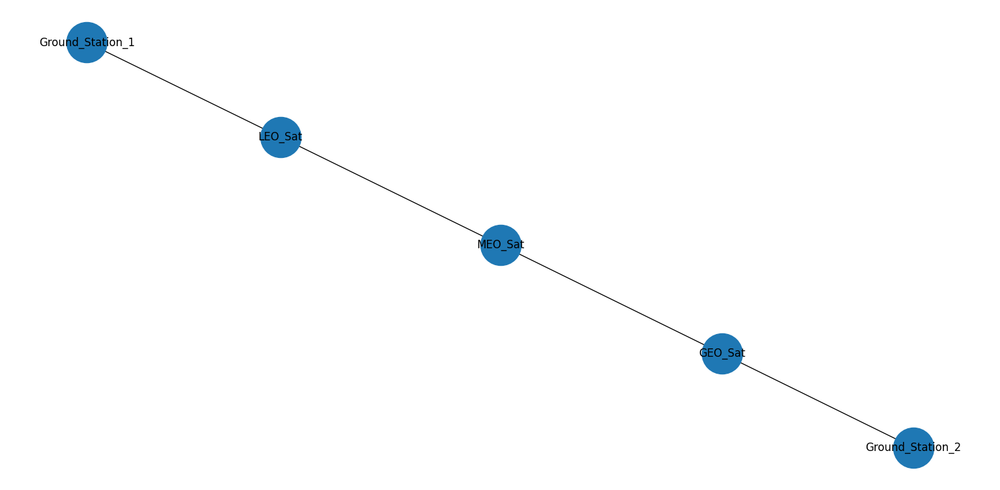
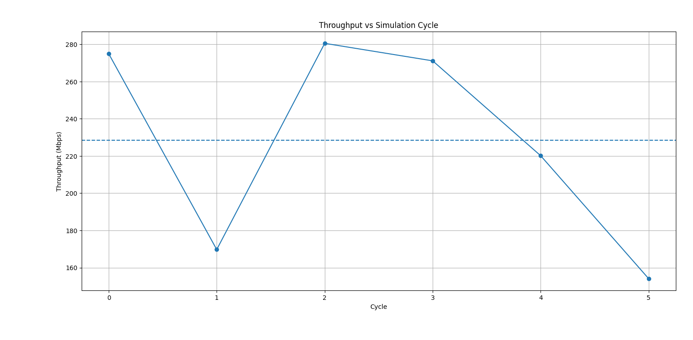
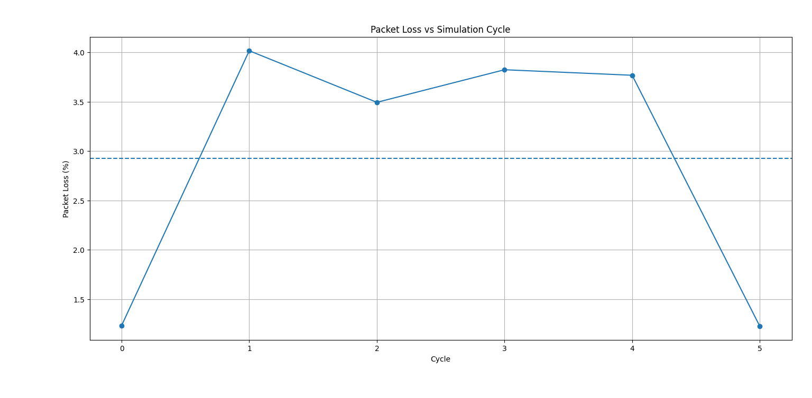
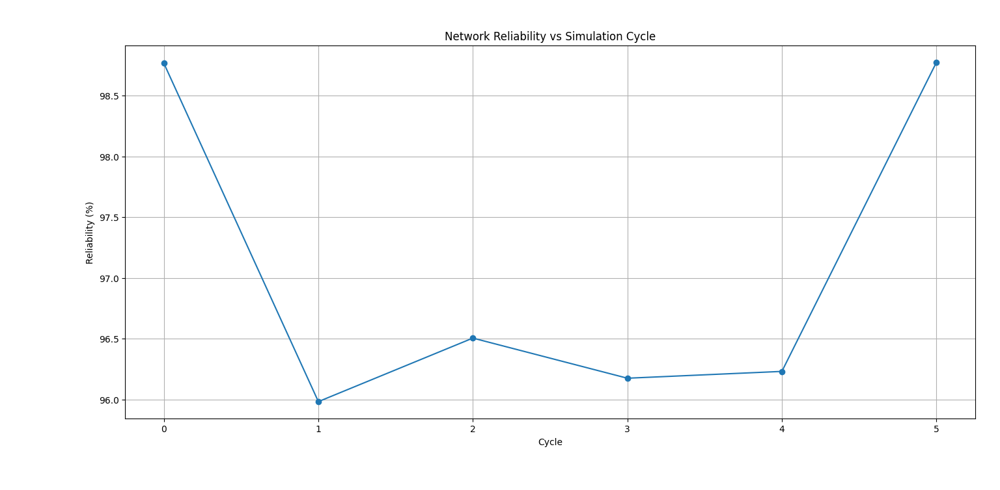
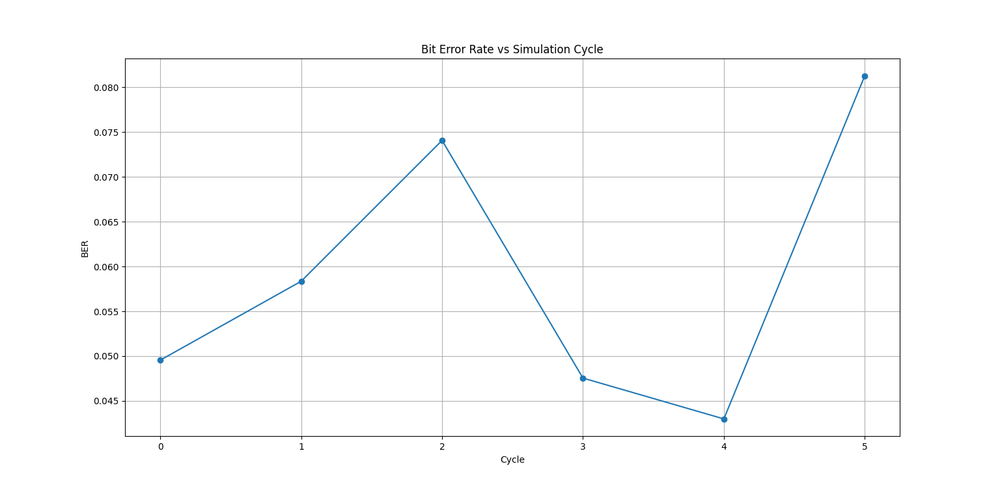

Self-Healing Satellite Communication Network Simulation

This project simulates a satellite communication network between ground stations using LEO, MEO and GEO satellites.

The simulation analyzes signal propagation and network performance using parameters such as Free Space Path Loss (FSPL), Signal-to-Noise Ratio (SNR), Bit Error Rate (BER), delay, throughput and packet loss.

The network uses routing algorithms to dynamically select the best communication path and maintain reliable connectivity between satellites and ground stations.

Tools Used

- Python
- NetworkX
- Matplotlib

Project Files

- "satellite_network_simulation.py" – Python simulation code
- "satellite_self_healing_network_report.pdf" – Project report

Author

Manisha K
B.E Electronics and Communication Engineering (ECE)

## Simulation Results

